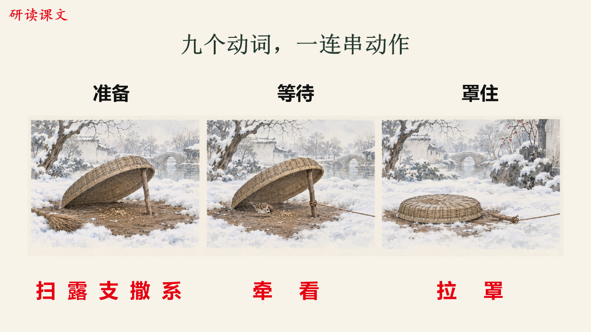

# 智能生产 PPT 课件系统

**面向初中语文备课的 AI 辅助课件制作与质量检查项目。**

围绕真实备课需求，把教材核对、教学活动设计、可编辑 PPT、教师用稿和交付检查组织成可重复执行的工作流程。项目重点是让课件内容、教师要求与最终文件保持一致，并在反馈后安全修订。

本仓库用于作品展示与技术交流。核心源码、完整 Skill、教师档案、原始资料和可复用课件包不公开提供。

## 先看实际成果

下图是已制作课件的一页静态预览：将文本中的动作拆成可观察的阶段，并用图文共同组织阅读活动。预览来自实际制作结果，不是界面概念图；配图为文学情境插画。

进一步查看：[分步呈现与返修案例](docs/case-study.md)。其中保留了一个真实的版面失败及修正前后对比，可以看到项目怎样处理制作结果中的具体问题。

## 解决的问题

课件制作不仅需要排版：还需要核对教材与注音、安排课堂问题和反馈、落实逐次点击、配套教师授课说明，并在修改后检查版本是否一致。

项目将这些工作连接起来，同时区分通用教学方法、教师个人设置和单课例外，避免换课或换教师时串用内容与偏好。

## 工作流程

## 核心工作

本项目采用人机协作方式：由人提出和澄清需求、判断教学内容与成品问题，AI 助手辅助整理材料、编写与执行脚本、制作和返修文件。工具自动检查与人工内容、视觉判断分别记录；不将 AI 生成代码表述为逐行手写，也不将产物生成视为自动验收通过。

| 方向 | 实现内容 | 解决的问题 |
| --- | --- | --- |
| 教学流程 | 将备课、教材核对、阅读与表达训练整理为可复用 Skill | 减少只有知识点、缺少课堂活动的页面 |
| 教师配置 | 分离通用方法、个人呈现设置与单课调整 | 避免偏好串用，支持有边界的定制 |
| 可编辑交付 | 原生文本对象、逐页授课备注、按课堂阶段显示内容 | 支持后续修改和实际授课操作 |
| 文件检查 | 解析 PPTX 的 OOXML，检查指定文字、局部字体、备注与点击结构 | 识别部分可以自动发现的内容与结构问题 |
| 修订与版本 | 保留原件，核对文件哈希与检查证据，拒绝错版打包和覆盖 | 避免旧检查记录对应到新成品 |
| 验收 | 自动化回归与人工内容、版面审阅分开记录 | 明确程序检查与课堂效果的区别 |

## 已形成的成果

- 两个语文课件案例及相应备课材料，覆盖不同课时安排与内容设计。
- 一套随项目迭代的备课 Skill，以及教师配置、PPTX 检查和交付核对工具。
- 使用匿名配置和合成 OOXML 素材的自动化回归测试。

已复核的两个案例分别包含 **49 页课件、49 页授课备注、101 组单击呈现**，以及 **37 页课件、37 页授课备注、38 组单击呈现**。这些是文件结构统计，不代表课堂效果评价。

可移植工具快照的 **46 项程序测试**已通过，并在干净检出的副本中再次通过。测试涉及配置校验、原件保护、备注、点击结构、文本框位置、成品版本一致性和打包边界。

这些证据支持对任务拆解、Agent 工作流、结果核验和迭代过程的初步评估。静态作品与测试摘要不能独立证明全部源码质量；需要深入核验时，可在另行约定范围后演示本地流程、解释设计取舍，或展示选定模块。

完整课件与源码保留在私有环境；展示页不包含私人反馈、真实教师档案、学生信息、教材扫描件或原始运行日志。

## 技术与项目边界

项目使用 Python、JavaScript、JSON 配置与 PPTX/OOXML 文件处理，并结合 AI 助手和演示文稿制作工具完成内容与制品迭代。

当前形态是经过真实制作需求迭代的工作流程与辅助工具，尚不是输入任意课文即可无人审阅交付的独立应用。文件检查不能替代教学判断、逐页视觉审阅、目标软件放映或真实课堂验证。未统计可用于对外承诺的制作提效比例，也不以测试数量宣称教学效果。

## 权利与使用

本项目采用私有源码、公开介绍的展示方式，未授予开源软件许可。原创展示内容的权利声明见 [NOTICE](NOTICE.md)。
