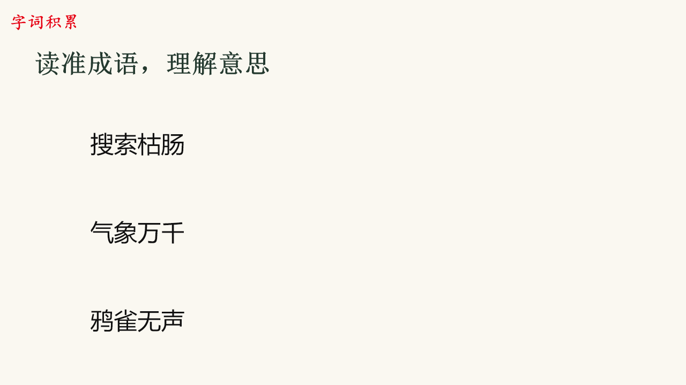
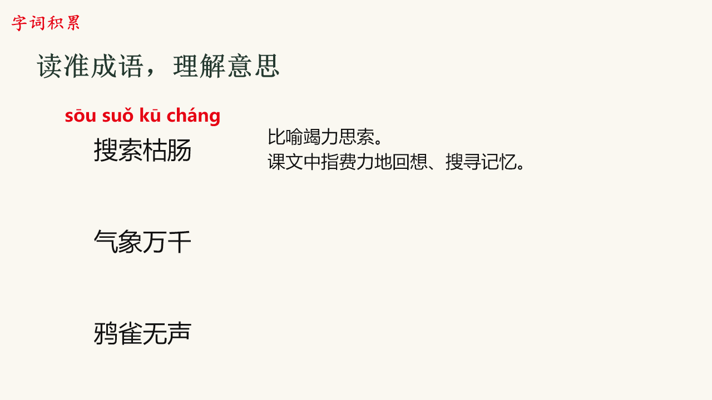
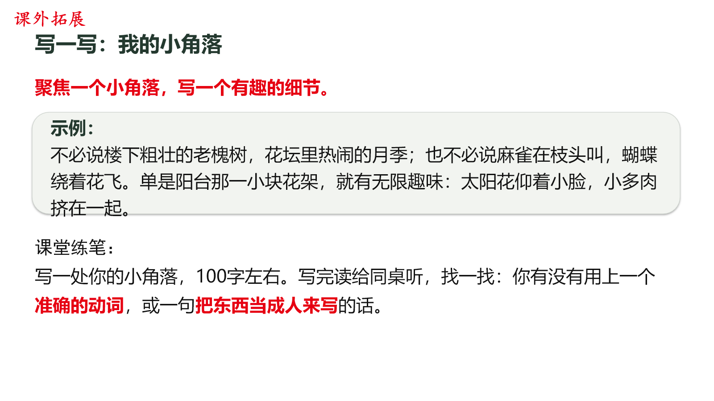
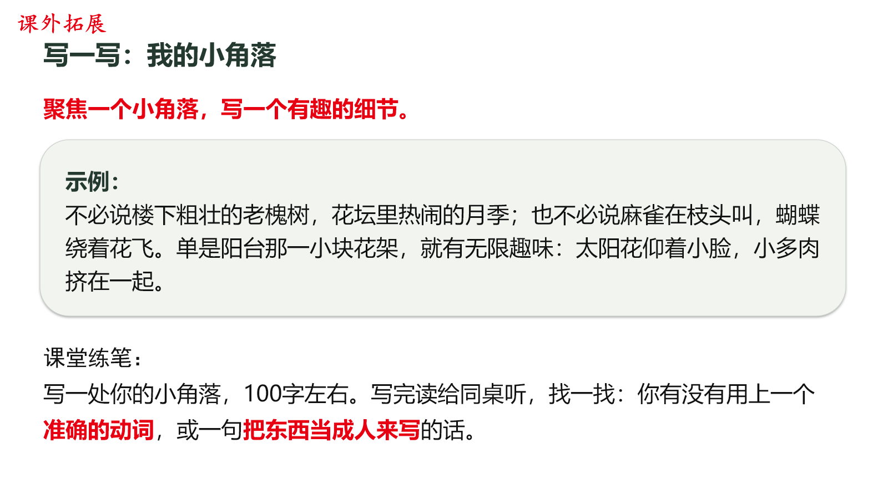

# 案例：把生成结果变成可检查的课堂材料

本页选取实际项目中的成品状态和一个返修案例，展示需求如何进入制品、怎样发现不足，以及检查结果的适用范围。仅发布有限静态片段，不包含源码、完整课件、教师身份或原始对话。

## 让一次点击对应一个完整教学反馈

字词认读页需要先呈现全部成语，之后每次点击同步显示一个成语的注音和解释。若只把“注音逐项”“解释逐项”分别设置为逐次出现，并不能保证它们在同一次点击中同步。

制作时将同一个成语的注音和解释归入同一呈现步骤，随后核对初始内容、每个点击组的对象与对应关系。下列两图是根据课件结构生成的静态状态检查图，分别表示初始状态与第一次揭示后的内容，**不是目标演示软件的放映录屏**。

初始状态：

第一次揭示后：

这一案例体现的是把自然语言要求细化为可核对的行为：初始可见内容、单次触发、对象分组和文字配对需要分别确认。完整成品的目标软件播放效果仍应另行试放。

## 处理跨渲染环境中的文字溢出

在一份五页验证样张中，使用反馈指出写作示例框的末行超出底边。既有的一种预览不足以发现问题；换到本地渲染环境后，示例标签与正文的换行方式不同，原有空间不再够用。

修正前，末行与示例框底边重叠：

修正时保留文字、字符样式和字号，调整示例区域高度、内边距与分段，并下移后续练笔内容。另两页也处理了语义断行。采用局部文件修改，保留原动画时间线、备注和图片。

修正后，完整示例位于框内，后续练笔内容仍清楚可读：

| 检查项 | 本次证据与结果 |
| --- | --- |
| 问题复现 | 本地渲染实际显示示例末行越过框底 |
| 局部量测 | 已知示例区域内的字形像素测量：修正前约超出3 pt，修正后约留27 pt底部空间 |
| 修改范围 | 制品记录显示仅第3、4、5页的页面XML变化 |
| 内容与格式保护 | 字符内容及样式相同，没有缩小学生文字字号 |
| 交互保护 | 原生时间线一致，其余包内部件字节一致 |
| 视觉复核 | 改动页重新查看，未变页与此前审阅图逐像素比较 |

该量测依赖已知卡片区域，不能当作通用溢出检测算法；本例也不代表所有播放环境已经验证。项目将这次问题转化为后续检查要求：检查实际渲染中的首末行、标签占用空间和跨环境差异，而不只看文本框几何参数或“已导出”状态。

## 可以据此核验什么

- 能否把模糊要求转成明确的输出行为和检查条件。
- 是否识别了生成结果中的真实缺陷，并能说明其触发条件。
- 返修是否控制了范围，保留原件、文字内容和既有交互。
- 报告是否区分程序检查、静态视觉检查和真实放映。

这些片段用于初步了解实际工作质量。更深入的代码能力、方法理解和个人贡献，可以通过具体追问、运行演示与经授权的模块审阅进一步核实；完整核心实现继续保留在私有仓库。
